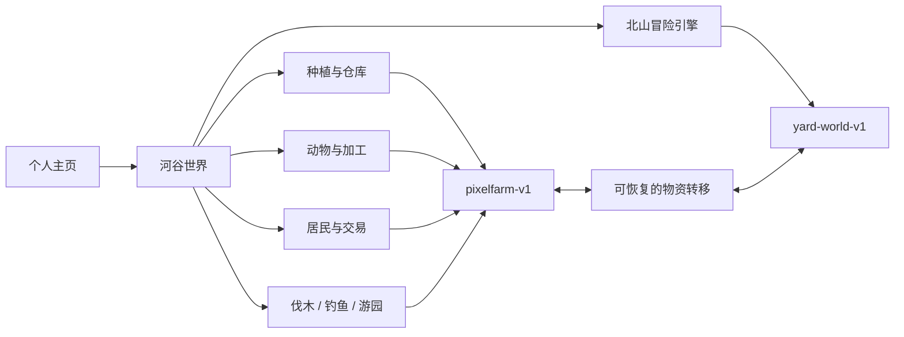

# 后院物语的世界结构

页面保持零构建依赖，使用有明确加载顺序的经典脚本。农庄、小镇与牧场复用同一个经营状态，不复制第二套库存或进度。`world.js` 管理世界交互，`world-art.js` 只负责原创景物。

## 绘制与坐标

世界大小为 1120 × 880 个逻辑像素。农庄田地左上角在 `(170,345)`，小镇地图原点为 `(625,300)`，牧场为 `(125,510)`。`toScreen` 将田地坐标映射到相同的世界镜头，原种植绘制和操作逻辑继续使用原来的 7 × 5 格田。

小镇和牧场分出 `renderTownMap` / `renderRanchMap`，把现有美术绘制到离屏画布，再放进世界地图。静态地形和树木精灵按季节缓存；动态场景以约 10Hz 更新，世界镜头和角色使用 requestAnimationFrame。主画布 DPR 限制为 2，避免高密度屏幕的过大画布。文本界面使用本地字体，不放大低分辨率字形。

角色与树木按脚底的 Y 坐标排序。行走使用帧时间；减少动态效果关闭装饰动画和镜头缓动，不停止移动。农庄时间在浏览器后台或经营窗口打开时暂停。

## 行走与交互

点击地面在 8 像素网格上运行 A*，使用最小堆管理候选节点。寻路和实际行走共用房屋、山体、河岸等障碍定义，斜向移动不能穿过障碍角。点击地点设置待执行互动，角色靠近后执行；方向键输入会取消自动路线。

`regions` 定义地图目的地与区域名字，`nearbyTargets` 连接真实田地、居民、建筑、动物和矿洞。新增地点时，需要同时补地图绘制、目标位置和必要的障碍几何。

## 矿洞边界

冒险引擎保留自己的横版物理、地形与装备，通过同源 iframe 在世界壳内运行，避免经营引擎与冒险引擎的全局变量冲突。进入前暂停农庄；冒险准备好后保存两侧状态并转移建材，统一日历后开始冒险。退出时保存冒险、结算材料、补算游戏小时，再卸载冒险引擎。

`BackyardAdventure` 只暴露保存、材料同步、暂停和日历接口。高级装备、消耗品、方块地形不转成经营物品；可转移的八种材料由 `BackyardStorage.MATERIALS` 显式定义。

## 转移恢复

每次转移先验证两侧存档，计算完整的新存档，再写入恢复记录，随后分别落盘并清除记录。任意一步中断，下次读取会把同一结果完整写回；不会重新发奖励。没有成功保存前，矿洞保持暂停并允许重试。这个流程适用于一个活动游戏标签页；同时在多个标签页操作同一浏览器存档不提供事务隔离。

测试以模拟存储覆盖每个写入中断点，并通过浏览器验证真实合成消耗后往返材料数量。

## 户外玩法

`world-data.js` 提供七区目的地、树木、钓点、摊位与障碍的公共坐标，渲染和寻路共用。`activity-rules.js` 保持无 DOM 的规则函数；`activities.js` 连接世界中的真实目标、小面板与经营状态。

户外进度保存在 `town.outdoors`，包括树木剩余状态、票券、历史最佳、当天奖励次数和累计采集。旧存档的新增字段安全补齐。树木再生使用共享日历，不依赖现实时间；木材、树脂、鱼获、兑奖种子与饲料写入原库存。

小游戏运行时停止行走与自动世界时钟，但小游戏帧更新继续。结束或提前离开仅推进一次指定游戏小时；钓鱼抛竿时扣鱼饵和次数，避免提前关闭重复获得免费尝试。页面后台暂停小游戏计时，失焦释放控线按键。套圈和翻牌无倒计时，打靶为二十秒，钓鱼使用按住与松开的控线操作。键盘焦点留在小游戏面板，Esc 返回地图。

全景镜头固定世界中心并适配视口，跟随镜头回到角色；两者复用相同点击坐标换算。地图总览使用实时田地、牧场、小镇与树木状态。

## 首页原创开屏

`opening.js` 管理首次访问、会话记忆、三段归家节奏、焦点、跳过、回看及木门转场。`opening-scene.js` 提供 Canvas 2D 场景工厂，只暴露绘制、重设尺寸和释放画布；实际播放时才加载，没有第三方运行依赖。

画面由本站代码原创绘制：星空、远山、杉林、矿洞、摊位、田地、小屋、河流、木桥、风车与提灯归家的人。镜头通过地平线下行、近景轻微放大及不同距离的指针视差推进；小屋灯火依次亮起，归家人物走向门口。前景木门与主页纸木色衔接，以门扇展开完成进入。

画布使用约半个视口的像素尺寸，最高宽度 900，限制场景绘制为 30Hz；DOM 文案和控制保持清晰。手机单独计算景物比例与排版。开场约十秒，后台暂停时间，减少动态效果直接进入主页。

开屏期间主页 inert；未显示的邀请按钮不可聚焦。Tab 保留在可用控制内，关闭后恢复原焦点。关闭或导航离开会停止帧循环并释放画布，异步加载通过播放标识阻止重新激活已跳过的开屏。Canvas 不可用或脚本加载失败保留静态河谷背景与进入操作。
